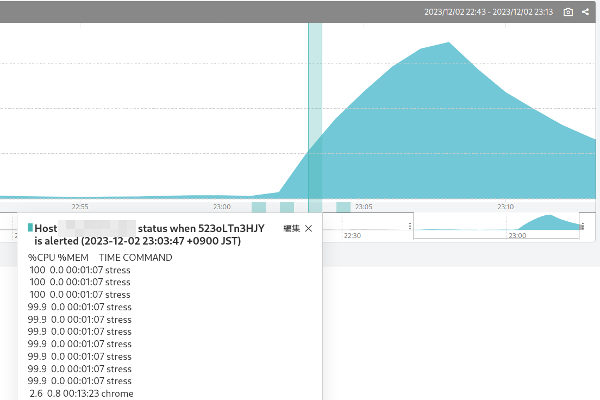

# sabanote

[English](README.md)

## 説明

**sabanote**（さばのて）は、SaaS 型監視サービス [Mackerel](https://ja.mackerel.io) のエージェントのプラグインとして動作し、関係するアラートが発生したときに、その時間付近のホスト上の高負荷なプロセス情報または任意のコマンド実行結果を[グラフアノテーション](https://mackerel.io/ja/docs/entry/howto/view-graphs#graph-annotations)に記録します。



## 概要
```
check-sabanote -m MONITOR_ID -s SERVICE -r ROLE [その他のオプション]
```

最低限必要な指定は、監視対象の監視ルール ID（`-m`）、グラフアノテーションを投稿する対象のサービス名（`-s`）およびロール名（`-r`）です。

監視ルール ID とロールは複数指定できます。

```
check-sabanote -m MONITOR_ID1 -m MONITOR_ID2 -s SERVICE -r ROLE1 -r ROLE2
```

監視ルール ID は、監視ルールを開いたときの URL `https://mackerel.io/my/monitors/<XXXXXXXX>` の `<XXXXXXXX>` の部分です。`mkr monitors` で調べることもできます。

このプラグインは、実行のたびにプロセス情報の収集（または任意のコマンド実行結果）をシンプルなデータベースに記録します（デフォルトのプラグイン設定では 1 分ごと）。

さらに定期的に Mackerel のサーバーにアラートが存在するかを問い合わせ、以下の条件に合致するときにデータベース内の情報をグラフアノテーションとして書き込みます。

- アラートの監視ルール ID に一致し、かつアラートにホスト ID が記載されていてそれも一致する
- アラートの監視ルール ID に一致し、かつアラートにホスト ID の記載がない（外形監視など）
- チェック監視や connectivity によるアラートで、ホスト ID が一致している

デフォルトではアラート発生時刻の3分前〜アラート発生時刻の1分後までの各分ごとにグラフアノテーションが書き込まれます。

デフォルトで書き込まれる内容は OS によって異なります。

- Linux・macOS：`ps` コマンドに基づく、CPU またはメモリ使用量の上位20位までの結果
- Windows：`Get-Process` PowerShell コマンドに基づく、CPU 消費時間またはメモリ使用量の上位20位までの結果

## mackerel-agentでの設定
プラグインは `mkr` コマンドでインストールできます。

```
sudo mkr plugin install github.com/kmuto/sabanote
```

mackerel-agent.conf にプラグインの設定を記述してください。

```
[plugin.checks.sabanote]
command = ["check-sabanote", "-m", "MONITOR_ID", "-s", "SERVICE_NAME", "-r", "ROLE_NAME"]
```

## 使い方
### オプション
- `--monitor MONITOR_ID, -m MONITOR_ID`：対象の監視ルール ID。`-m` オプションを複数指定することで、複数の監視ルールを対象にできる
- `--service SERVICE, -s SERVICE`：グラフアノテーションの投稿先のサービス名
-  `--role ROLE, -r ROLE`：グラフアノテーションの投稿先のロール名。`-r` オプションを複数指定することで、複数のロールを対象にできる（ただし、サービスをまたがって指定することはできない）
- `--host HOST_ID, -H HOST_ID`：対象のホスト ID
-  `--title TITLE`：グラフアノテーションのタイトル。デフォルトは `Host <HOST> status when <ALERT> is alerted (<TIME>)` で、`<HOST>` はホスト ID、`<ALERT>` はアラート ID、`<TIME>` は発生時刻に置き換えられる
- `--mem`：上位プロセスを表示する際に、メモリ使用量の順に並べる。指定しない場合は CPU 使用率順になる
- `--cmd CMD_PATH, -c CMD_PATH`：プロセス情報の代わりに、任意のコマンドを実行し、その標準出力の内容をグラフアノテーションで使うようにする
- `--state DIR`：簡易データベースを配置するフォルダ
- `--before MINUTES`：アラートが発生してから何分前までの記録をグラフアノテーションに書き込むか。0〜5 で指定し、デフォルトは 3
- `--after MINUTES`：アラートが発生してから何分後までの記録をグラフアノテーションに書き込むか。0〜5 で指定し、デフォルトは 1
- `--alert-frequency MINUTES`：アラートが存在するか問い合わせる際の実行間隔（分）。2〜30 で指定し、デフォルトは 5。また、0 を指定するとアラートの存在を問い合わせない
- `--delay SECONDS`：プロセス情報の取得または任意のコマンドを実行する際の実行前待ち時間（秒）。0〜29 で指定し、デフォルトは 0
- `--verbose`：各段階のデバッグログを標準エラーに書き出す
- `--help, -h`：オプションヘルプを表示する
- `--version`：バージョンを表示する

### オプションのヒント
mackerel-agent のプラグインの実行にはタイムアウトの制限があります。基本的に 30 秒以内で処理が終わるように注意する必要があります。

`-H` オプションによるホスト ID 指定は、mackerel-agent がインストールされている環境ではその ID が自動で使われるので基本的には不要です。あえて別のものを対象にしたいときに指定してください。

`-c` によるコマンド実行は、単一の実行ファイルのみを受け付け、オプションは指定できません。オプションを含めてラップするようなスクリプトにするなどで対処してください。また、グラフアノテーションの制約上、1KB までに収める必要があります。

`--delay` による実行遅延は、Windows の WMI アクセスが集中して取得できない場合への対策です。プラグインの実行のタイムアウトの制限にも注意してください。

connectivity エラーが発生している状態でも簡易データベースには記録が継続していますが、保持されるのは 6 時間前までです。

このチェックプラグイン自体は OK または Unknown（コマンド実行の失敗やデータベース書き込み不正など）のみを返します。

## データベースの参照

データベースに保存されている情報を参照するために、`show-sabanote` コマンドを用意しています。

```
show-sabanote データベースファイル
```

デフォルトのデータベースファイルの位置は以下のとおりです。

- Linux: `/var/tmp/mackerel-agent/__sabanote/sabanote.db`
- Windows Server 2022: `C:\Windows\SystemTemp\__sabanote\sabanote.db`
- Windows Server 2016: `C:\Windows\Temp\__sabanote\sabanote.db`

## ライセンス
© 2023 Kenshi Muto

Apache License ([LICENSE](LICENSE) ファイル参照)
