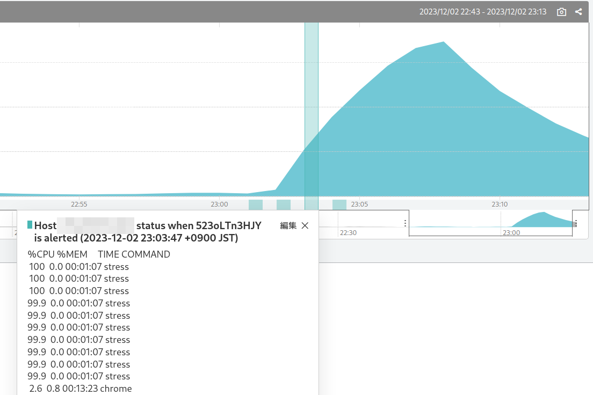

# sabanote

[日本語](README-ja.md)

## Description

**sabanote** runs as a plug-in for the agent of the SaaS monitoring service [Mackerel](https://mackerel.io), and when a relevant alert occurs, it records information on the heavily loaded processes (or any command output) on the host around that time to [Graph Annotation](https://mackerel.io/docs/entry/howto/view-graphs#graph-annotations).



## Synopsis
```
check-sabanote -m MONITOR_ID -s SERVICE -r ROLE [other options...]
```

The minimum required specification is the monitoring rule ID (`-m`) to be monitored, the service name (`-s`) and role name (`-r`) to which graph annotations are posted.

Multiple monitoring rule IDs and roles can be specified.

```
check-sabanote -m MONITOR_ID1 -m MONITOR_ID2 -s SERVICE -r ROLE1 -r ROLE2
```

The monitoring rule ID is the `<XXXXXXXX>` part of the URL `https://mackerel.io/my/monitors/<XXXXXXXX>` when opening the monitoring rule page. You can also look it up with `mkr monitors`.

This plugin logs the collection of process information (or the result of any command execution) to a simple database each time it is run (every minute by default).

It also periodically queries the Mackerel server for alerts and writes the information in the database as graph annotations when the following conditions are met:

- The alert's monitoring rule ID matches, and the host ID in the alert also matches.
- The monitoring rule ID of the alert matches and the host ID is not specified in the alert. (e.g., external monitoring)
- Check monitoring and connectivity alerts with matching host IDs.

By default, information is written to the graph annotation every minute from 3 minutes before the alert time to 1 minute after the alert time.

The content written by default depends on the operating system.

- Linux and macOS: Top 20 results for CPU or memory usage based on the `ps` command
- Windows: Top 20 results for CPU time or memory usage based on the `Get-Process` PowerShell command

## Setting for mackerel-agent
This plug-in can be installed with the `mkr` command.

```
sudo mkr plugin install github.com/kmuto/sabanote
```

Describe the plugin configuration in your mackerel-agent.conf.

```
[plugin.checks.sabanote]
command = ["check-sabanote", "-m", "MONITOR_ID", "-s", "SERVICE_NAME", "-r", "ROLE_NAME"]
```

## Usage
### Options
- `--monitor MONITOR_ID, -m MONITOR_ID`: target monitoring rule ID; multiple monitoring rules can be targeted by specifying multiple `-m` options.
- `--service SERVICE, -s SERVICE`: Name of the service to which graph annotation is posted.
- `--role ROLE, -r ROLE`: Name of the role to which graph annotation is posted. Multiple roles can be targeted by specifying multiple `-r` options (but not across services).
- `--host HOST_ID, -H HOST_ID`: Target host ID.
- `--title TITLE`: Title for the graph annotation. Default is `Host <HOST> status when <ALERT> is alerted (<TIME>)`, where `<HOST>` is replaced by the host ID, `<ALERT>` by the alert ID, and `<TIME>` by the time of occurrence.
- `--mem`: When displaying the top processes, order them by memory usage. If not specified, they are ordered by CPU usage.
- `--cmd CMD_PATH, -c CMD_PATH`: Execute any command instead of process information and use its standard output for graph annotation.
- `--state DIR`: Folder to place the simple database.
- `--before MINUTES`: how many minutes before the alert are to be written to graph annotations, from 0 to 5 (default 3).
- `--after MINUTES`: the number of minutes after the alert that should be written to the graph annotation, from 0 to 5 (default: 1).
- `--alert-frequency MINUTES`: The interval (in minutes) to query for the existence of an alert, from 2 to 30 (default is 5). If 0 is specified, no alerts are queried.
- `--delay SECONDS`: The number of seconds to wait before executing a command to get process information or execute any command, from 0 to 29 (default is 0).
- `--verbose`: Print debug logs for each stage to standard error.
- `--help, -h`: Display help messages.
- `--version`: display the version.


### Hints
There is a timeout limit for running the mackerel-agent plugin. Basically, you need to be careful to finish the process within 30 seconds.

Specifying a host ID with the `-H` option is basically unnecessary, since the ID is automatically taken from the environment where mackerel-agent is installed. Specify it when you want to target a different host ID.

Command execution with `-c` accepts only a single executable file, and no options can be specified. If you need options, you should use a script that wraps the command with options. Also, due to restrictions on graph annotations, the file size must be limited to 1KB.

The `--delay` execution delay is a workaround for when Windows WMI access is too busy to retrieve. Be careful also about the timeout limit for plugin execution.

The simple database will continue to record the connectivity error, but only up to 6 hours in the past.

The check plugin itself returns only OK or Unknown (e.g., command execution failure or database write malformed).

## Query the database

The `show-sabanote` command is provided to query information stored in the database.

```
show-sabanote <database-file>
```

On Linux, the database file is `/var/lib/mackerel-agent/__sabanote/sabanote.db`.

## License
© 2023 Kenshi Muto

Apache License (see [LICENSE](LICENSE) file)
